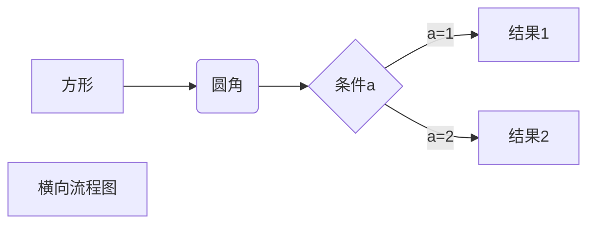

<p align="center">
  
</p>


简体中文 | [English](./README.md)

## 一、简介

VG710-Python-Templates是一个车载边缘计算解决方案，它基于python3和IoT实现，它使用了最新的物联网架构技术，内置了丰富的API接口，提炼了丰富的业务模块，提供了丰富的组件功能，它可以帮助你快速搭建定制化业务功能，相信不管你的物联网需求是什么，本项目都能够帮主到你

### 开发流程



```sequence
Title: 标题：复杂使用
对象A->对象B: 对象B你好吗?（请求）
Note right of 对象B: 对象B的描述
Note left of 对象A: 对象A的描述(提示)
对象B-->对象A: 我很好(响应)
对象B->小三: 你好吗
小三-->>对象A: 对象B找我了
对象A->对象B: 你真的好吗？
Note over 小三,对象B: 我们是朋友
participant C
Note right of C: 没人陪我玩
```


## 二、环境准备

要使用该模板快速开发您的车联网应用，你必须具备以下条件

### `1、映翰通的车载网关InVehicle Gateway710，简称VG710`

### `2、能够接入internet的物联网卡`

### `3、一台PC电脑，Windows/MacOS/Linux,并且已经接入Internet`

### `4、确保您的PC已经安装了以下软件：`

&emsp;&emsp;*(4.1).[MicroSoft VS code IDE开发工具](https://code.visualstudio.com/Download/)*

&emsp;&emsp;*(4.2).[Python3.7.X](https://www.python.org/downloads/)*

### `5、验证PC环境是否满足要求：`

&emsp;&emsp;*(5.1).按 <kbd>Win</kbd>+<kbd>R</kbd> 键，调出命令提示符，输入python，回车，弹出如下信息则说明python运行环境已经准备好*

```cmd
    Python 3.7.4 (v3.8.1:1b293b6006, Dec 18 2019, 14:08:53)
    [Clang 6.0 (clang-600.0.57)] on win64
    Type "help", "copyright", "credits" or "license" for more information.
    >>>
```

&emsp;&emsp;*(5.2).VS Code环境确认，完成VS code安装，需要在VS Code IDE的“Extensions”中安装插件才能继续使用*

&emsp;&emsp;&emsp;*(5.2.1).Python*

&emsp;&emsp;&emsp;*(5.2.1).Project Templates*

&emsp;&emsp;&emsp;*(5.2.1).SFTP*

&emsp;&emsp;*(5.3).VS Code环境确认，完成VS code安装，需要在VS Code IDE的“Extensions”中安装插件才能继续使用*

&emsp;&emsp;&emsp;*(5.3.1)make sure “Python: select Interpreter” is Python 3.7.x*


## 三、VG710-Python-Templates目录结构

本项目已经为你生成了一个完整的开发框架，下面是整个项目的目录结构。
```
├── .vscode                    # VS Code配置文件夹
│  └── sftp.json               # SFTP插件的配置文件，用于与InVehicleG710建立SFTP连接
├── build                      # App发布包文件夹
├── src                        # App源码文件夹
│  │── main.py                 # App程序入口
│  └── parse_config.py         # 解析App配置文件
├── config.yaml                # App配置文件
├── setup.py                   # App版本、SDK版本等信息说明
```


## 四、开发


# 打开命令提示符窗口

  Windows 10 ----> <kbd>Win</kbd>+<kbd>R</kbd>键

  MacOS10.14 ----> <kbd>command</kbd>+<kbd>空格</kbd>，输入terminal.app

  Linux      ----> <kbd>Ctrl</kbd>+<kbd>Alt</kbd>+<kbd>T</kbd>打开新终端


```
# 以MacOS为例，将文件存储在“Documents/”目录中

  cd Documents/

# 克隆项目

  git clone https://github.com/154386670/VG710-Python-Templates.git

```

# 五、修改项目名称

&emsp;将克隆的模板项目修改为自建项目名称，以“HelloWorld”为例，修改“VG710-Python-Templates”项目文件夹名称为“HelloWorld”

&emsp;文件目录如下：
```
  HelloWorld
  ├── .vscode
  │  └── sftp.json
  ├── build
  ├── src
  │  │── main.py
  │  └── parse_config.py
  ├── config.yaml
  ├── setup.py
```

# 五、将VG71-Python-Templates项目导入VS Code

&emsp;*（5.1）修改代码中的项目名称：*
```python
---------------------------------------------------------------------------
./Documents/HelloWorld/setup.py，代码片段：
..
...
    rom setuptools import setup, find_packages
    setup(name='helloworld',          #修改“appname”为“HelloWorld”
        sdk_version='0.2.0',
        version='0.0.0',
        author='Inhand',
...
..
---------------------------------------------------------------------------
./Documents/HelloWorld/src/main.py，代码片段：
..
...
    app = APPConfig(name="appname")   #修改“appname”为“HelloWorld”
    app_config_file = app.get_app_cfg_file()
...
..
---------------------------------------------------------------------------

```
&emsp;*（5.2）配置Sftp连接信息：*


```json
./Documents/HelloWorld/.vscode/sftp.json

{
    "name": "Debug Server",
    "host": "192.168.2.1",                    #车载网关以太网地址
    "protocol": "sftp",
    "port": 222,
    "username": "pyuser",
    "password":"VF7101937000028",             #车载网关序列号
    "remotePath": "/var/user/app/appname",    #修改“appname”为“HelloWorld”
    "uploadOnSave": true,
    "ignore":[
        ".vscode",
        ".git",
        ".DS_Store"
    ]
}
```

# 安装依赖

Copyright (c) 2020-present Xiaopeng Gou
